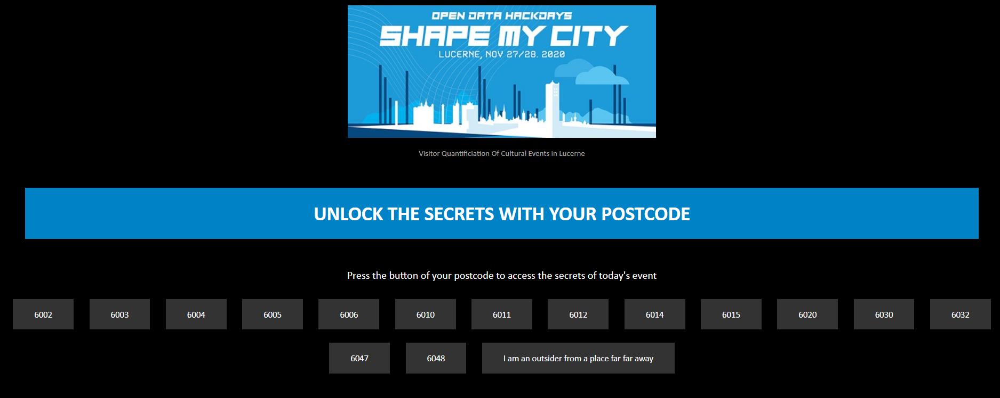

## Hackathon Shape my City - 27-28. November 2020

# 06 Quantification of visitors of cultural events in Lucerne

### Create a prototype of a technical solution to count visitors of cultural events

Team: Yvonne Schärli, Salome Isch, Thushanth Gunasegaram, Adriana Ricklin, Cengiz Cetinkaya, Christina Sudermann 

## 1) What is the challenge about

### Problem Description
The City of Lucerne would like to register how many people visiting cultural events in the City of Lucerne are actually residents of Lucerne and how many are visiting from the agglomeration (K5: Ebikon, Emmen, Horw, Kriens, City of Lucerne incl. Littau and Reussbühl) or even outside the Region. This information would be used by the City of Lucerne to discuss more accurately with the agglomeration, how much they have to pay to the city on cultural promotion.

### Idea of Implementation 
At the entrance of the cultural events we would put a tablet where visitors are asked to insert the zip code of their home address. This would be a voluntary process and the visitors will be rewarded with a funny thank you note, once they put in the information. For the City of Lucerne a dashboard with visualisations of the visitor flow to the different cultural events can be created.

### Goal
Create a prototype of a technical solution to count visitors of cultural events. What is the percentage of visitors from the city of Lucerne and the surrounding municipalities?

### Data
There is no data which can be used as the goal of the challenge is to find a way of collecting the data.

### Partner
City of Lucerne, Kultur & Sport

Link to the Hackathon Challenges:
[hack.opendata](https://hack.opendata.ch/event/35#top)

## 2) Practical Approach to solve the challenge

### Architecture
For this project the database management system MongoDB is used for the data storage. For the backend Python Flask is used, for the frontend the JavaScript React Framework and for the visualisations Tableau. 

### Backend
For Backend the Python web application framework Flask is used. A connection to MongoDB is setup.
Functions to get all postal codes and events entered by the visitors of the events on the web app and to write it into the database. 

### Frontend: WebApp
For the Front end Web development, the JavaScript React Framework was used. For this challenge a very simple App will be setup because only a few buttons are needed for the input of the zip codes. It should be as simple as possible for the user.
The user gets a feedback after inserting the zip code on the tablet.

Here is a first look of the WebApp with different buttons for the zip codes. 

### Visualisation
For the visualisations we wanted to set up a connection to the MongoDB, but this was in the short time of the hackathon not possible. Therefore Tableau visaulisations were created without a connection and with a sample dataset. 
The original idea was, to have a connection to MongoDB server which is regularly updated in order to have nearly real time data of the input of the zip codes at the events.

Here is an example of what it could look like on the tablet. Further visualisations can be found in the folder images in the power point presentation. 

## 3) Next steps
1. Frontend enlargement. To make it more user friendly the setup should be brought to the cloud. This would make the data more accessible for different users. Additionally, more postal codes are added for surrounding areas and the design of the web app is finalised.
2. Create further visualisations to give feedback to the visitors at the events. 
3. In order for the city of Lucerne to have an overview over the visitors, a second use case is created. According to the needs of the city of Lucerne visualisations in Tableau will be created. 
4. A pilot should be setup at one event location to test the web app.
